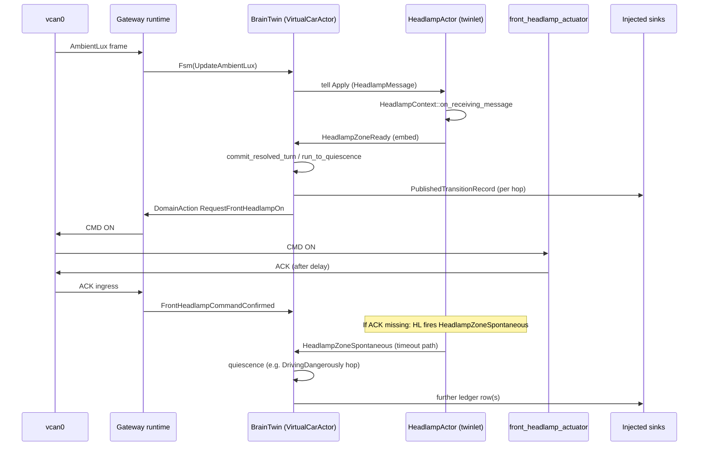

# SDV simulation (Iteration 3) — repository overview

---

↩️ This repo is **Iteration 3** of a software-defined-vehicle (#SDV) prototype. Each iteration
**grows on its predecessor** — reusing and refactoring what still fits, and changing structure
where the next goal requires it.

| Iteration | Repository                                                          | README                                                           | Pyramid / library layout                    |
| --------- | ------------------------------------------------------------------- | ---------------------------------------------------------------- | ------------------------------------------- |
| 1         | [`sdv_simulation_1`](https://github.com/nsengupta/sdv_simulation_1) | [Overview](https://github.com/nsengupta/sdv_simulation_1#readme) | —                                           |
| 2         | [`sdv_simulation_2`](https://github.com/nsengupta/sdv_simulation_2) | [Overview](https://github.com/nsengupta/sdv_simulation_2#readme) | —                                           |
| 3         | **`sdv_simulation_3` (this repo)**                                  | You are here                                                     | [`library-reorg.md`](docs/library-reorg.md) |

This README is the **operational truth** for running and reading the code. Blog posts and `blog-inputs/` are supplementary narrative — they may lag or simplify; when in doubt, trust this file and the linked `docs/`.

---

## What this iteration is about (and what it deliberately is *not*)

A Rust workspace that prototypes a **software-defined vehicle control path**: telemetry and actuation on a **shared CAN bus**, a **gateway** that projects wire traffic into twin vocabulary, and a **digital twin** that maintains vehicle state, decides when to actuate, and closes the loop when the body ECU acknowledges (or fails).

Educational / demonstrator — not a product stack.

**Iteration 1** made the control loop *work*. **Iteration 2** made it *decomposable, observable,
and provable* — zone assemblies, a serializable transition ledger, diagnostics, and
correct-by-construction twin APIs — while keeping the same three-process CAN demo on the surface.
**Iteration 3** (this repo) takes the next step: the **digital twin** becomes a **BrainTwin**
(parent) plus **twinlets** (zone child actors) — without rewriting the domain core. In this
iteration there is only **one twinlet**: the headlamp zone (`HeadlampActor`).

**What Iteration 3 is *not* (yet):**

- Not a full vehicle SDV stack — only the **headlamp twinlet** runs as a child actor today.
  Powertrain, health, and visibility zones are still in-process inside the BrainTwin. (See
  **BrainTwin and twinlets** below for vocabulary.)
- Not production safety certification — the correctness model is a teaching scaffold.
- Not the offline ledger analyser — the gateway can emit a **machine-oriented transition stream**;
  the reader/report tool is designed but unbuilt (see Demo screenshots).
- Not a replacement for the pyramid/ADR docs — layer numbers (L0–L6) live in
  [`docs/library-reorg.md`](docs/library-reorg.md); this README uses plain names first.

---

## What's new across the series (Iteration 1 → 2 → 3)

| Area                     | Iteration 1                  | Iteration 2                                                                       | **Iteration 3 (this repo)**                                                                      |
| ------------------------ | ---------------------------- | --------------------------------------------------------------------------------- | ------------------------------------------------------------------------------------------------ |
| **Twin context**         | Flat `VehicleContext`        | Per-**zone assembly** contexts (`powertrain`, `health`, `visibility`, `headlamp`) | Same aggregate; **headlamp zone** also runs in a **child actor**                                 |
| **FSM `step`**           | Monolithic inline logic      | Thin orchestrator; behaviour on assemblies                                        | Unchanged pure core; **BrainTwin commit** adds **quiescence** (multi-hop ledger)                 |
| **Concurrency**          | Single `VirtualCarActor`     | Same (prep for zones)                                                             | **BrainTwin** + one **twinlet** (`HeadlampActor`)                                                |
| **BrainTwin ↔ zone I/O** | In-process L1 calls          | Same on demo path                                                                 | **Enumerated mailboxes** (tell / tell-back / spontaneous) on production path                     |
| **Transition ledger**    | State delta, in-process time | **`PublishedTransitionRecord`**, `record_seq`, `as_of_seq`                        | **One row per quiescence hop**; optional **ledger-only stdout** (`--print-transitions-only`)     |
| **Invariants**           | Inline checks                | **`STATE_LAWS`** oracle (offline)                                                 | Same; detectors feed **internal FSM events** at commit                                           |
| **Twin mutation**        | Public fields                | **`apply_step`** only                                                             | Same                                                                                             |
| **Diagnostics**          | NACK/timeout only            | Silent-success ACK surfaced; off-hot-path logging                                 | **Sink injection at gateway init** (default vs ledger-only)                                      |
| **Module layout**        | Ad hoc                       | Layering started                                                                  | **Pyramid L0–L6**, [TangleGuard](https://tangleguard.com/apps/cli) clean (`pyramid-m2-complete`) |

Future on the actor track: a second zone twinlet (use the **Headlamp twinlet** as a template), ADR-6 power barrier,
actuation child actor, offline ledger verifier, optional `sdv_core` crate split.

---

## Key features added / improved (Iteration 3)

### BrainTwin and twinlets (our vocabulary)

Three terms, two sources:

| Term          | Origin             | Meaning in this repo                                                                                                                                                                                                                                                             |
| ------------- | ------------------ | -------------------------------------------------------------------------------------------------------------------------------------------------------------------------------------------------------------------------------------------------------------------------------- |
| **Zone**      | SDV industry lingo | A partition of vehicle concern and twin state (lighting, powertrain, …). In code: a **zone assembly** — `{Zone}Context` inside `VehicleContext` (ADR-5).                                                                                                                         |
| **Twinlet**   | **Our term**       | One zone’s logic running as a **child actor** under the BrainTwin, with its own mailbox and timers. Not standard SDV jargon — we use it for “a small twin scoped to one zone.”                                                                                                   |
| **BrainTwin** | **Our term**       | The **digital twin as a whole** in the broad sense: parent actor, operational FSM commit, ledger, actuation dispatch. Implemented as **`VirtualCarActor`**; the **`DigitalTwinCar`** capsule is its authoritative state. We say **Brain** interchangeably in prose and diagrams. |

```text
Digital twin (simulation)
└── BrainTwin (VirtualCarActor)     ← parent: ingress, quiescence, sinks, actuation
    ├── twinlets (child actors)     ← one per actorified zone — our term
    │   └── HeadlampActor           ← only twinlet in this iteration (headlamp zone)
    └── other zones (in-process)    ← powertrain, health, visibility — not twinlets yet
```

**This iteration:** one BrainTwin, **one twinlet** (`HeadlampActor` for the headlamp zone). Later
iterations add more twinlets; the BrainTwin role stays the same.

### Headlamp twinlet (`HeadlampActor`)

**Zone** (SDV): body / front headlamp — lighting state and ACK bookkeeping.

**Twinlet** (ours): that zone as [`HeadlampActor`](crates/common/src/twin_runtime/headlamp_actor.rs),
a [`ractor`](https://crates.io/crates/ractor/0.15.12) child of the BrainTwin — use this **Headlamp twinlet** as a template for the next zone twinlet. Milestone handoff:
[`docs/milestone-actor-headlamp-scope.md`](docs/milestone-actor-headlamp-scope.md).

### BrainTwin (`VirtualCarActor`)

The **BrainTwin** is **`VirtualCarActor`** — the parent actor inside the gateway that:

- receives ingress as `DigitalTwinCarVocabulary` (FSM events, twinlet tell-backs, RPC),
- **tells** twinlets (today: **`HeadlampActor` only**) and waits for correlated tell-back,
- runs **`commit_resolved_turn` → `run_to_quiescence`** (ADR-7) before persisting,
- emits **ledger** and **diagnostic** records through injected sinks,
- dispatches **actuation** intents to the gateway CAN egress path.

The pure **`fsm::step`** table still decides operational mode; the BrainTwin orchestrates *when*
zones run and *when* the stable **cut** is persisted — it does not replace L2 logic.

### Pyramid layout and quiescent commit

- **Pyramid (L0–L6)** in `common`: acyclic module layers; gateway uses **`facade` only**.
  Detail: [`docs/library-reorg.md`](docs/library-reorg.md).
- **Cut** — one **snapshot** of the digital twin at an instant:
  `(FsmState, VehicleContext)` — operational mode plus the full summated world (headlamp, lux,
  powertrain, health, …). The ledger records **hops between cuts**; quiescence ends on a
  **stable cut** where no further internal hop is pending.
- **Quiescence** — after zone embeds merge, the BrainTwin may apply **several FSM hops** (e.g.
  external lux event → incomplete lamp embed → **internal** `LightingUnsafe` →
  `DrivingDangerously`) before the twin reaches a **stable cut**. Each hop gets **one ledger row**;
  **one** `apply_step` applies the final cut. Detail: [`docs/adr-007-fsm-quiescence-and-cut.md`](docs/adr-007-fsm-quiescence-and-cut.md).
- **Spontaneous (twinlet-initiated)** — a twinlet reports on its **own deadline** without a new
  external ingress event, e.g. **`HeadlampActor`** ACK wait fires →
  `DigitalTwinCarVocabulary::HeadlampZoneSpontaneous` → BrainTwin commits an incomplete-lamp hop.
  Contrasts with **correlated tell-back** (`HeadlampZoneReady`) after a BrainTwin **tell**.

BrainTwin ↔ **`HeadlampActor`** use **enumerated mailbox types only** on the production path (no
shared in-process L1 calls across the actor boundary). ACK wait is actor-owned (`send_after`), not
gateway `TimerTick`.

---

## Runtime shape (unchanged from Iteration 1 / 2)

**Three processes** share Linux **SocketCAN** (`vcan0` by default):

| Process                     | Role                                                                                          |
| --------------------------- | --------------------------------------------------------------------------------------------- |
| **emulator**                | Publishes **engine RPM** and **ambient lux** on CAN (~10 Hz). Does **not** send headlamp CMD. |
| **gateway**                 | CAN ingress/egress, projection, **BrainTwin** + **`HeadlampActor`**, actuation CMD TX.        |
| **front_headlamp_actuator** | Body ECU stand-in: CMD → ACK/NACK (~150 ms).                                                  |

Outcomes appear on **stdout** by default (diagnostics) — a stand-in for dashboard / cloud.
Optional **ledger-only** stdout (see Demo screenshots). VSS-inspired signals; wire layout in
**`vehicle_device_bus`**.

### Demo screenshots

Still frames from a live three-process run on `vcan0`. **Emulator and actuator behaviour match
Iteration 2** — same RPM/lux publishing and CMD/ACK loop.

What is **new in Iteration 3** is mainly **inside the gateway digital twin** (BrainTwin + headlamp
twinlet, quiescent commit) and an optional **ledger-only console mode**:

```bash
cargo run -p gateway -- --print-transitions-only   # coloured transition rows; no diagnostic sink
```

**Daylight (`lux ≥ 860`):** headlamp stays off; no CMD/ACK traffic (same as before).


**Tunnel (`lux ≤ 840`):** twin requests ON → CMD on CAN → actuator ACK/NACK/timeout (same as before).


**Planned tooling:** the ledger stream is shaped for an **offline reader** — a tool (or small
suite) that ingests `PublishedTransitionRecord` rows and **reports, summarises, or replays** what
happened **between two time instants** (or two `record_seq` values). Not implemented in this repo
yet; default gateway mode remains human diagnostics on stdout.

---

## Architecture

Telemetry and commands meet on one virtual CAN interface; the gateway is the only component
that speaks both wire and twin.


> **Diagram (planned):** internal layout of the BrainTwin and twinlets inside the digital twin
> capsule — to be added alongside this overview.

### Vocabulary (read this before the diagrams)

| Term                  | Meaning in this repo                                                                                                                                        |
| --------------------- | ----------------------------------------------------------------------------------------------------------------------------------------------------------- |
| **Zone**              | SDV term: a vehicle concern partition. Code: **zone assembly** — `{Zone}Context` in `VehicleContext` (ADR-5).                                               |
| **Twinlet**           | **Our term:** one zone as a **child actor** under the BrainTwin (mailbox + local timers).                                                                   |
| **BrainTwin / Brain** | **Our term:** the digital twin overall — parent actor (`VirtualCarActor`), FSM commit, ledger, actuation. **`DigitalTwinCar`** = its state capsule.         |
| **`HeadlampActor`**   | The **only twinlet** in this iteration — headlamp zone.                                                                                                     |
| **Tell**              | BrainTwin → twinlet message; **fire-and-forget** — no reply port on that hop, so the BrainTwin mailbox stays free until **tell-back** or tell-back timeout. |
| **Tell-back**         | Twinlet → BrainTwin reply, correlated by `turn_id` / `tell_attempt` (e.g. `HeadlampZoneReady`).                                                             |
| **Quiescence**        | Multi-hop resolve (zone merge + `step` + detectors) until stable; then one `apply_step`.                                                                    |
| **Spontaneous**       | Twinlet-initiated tell-back (e.g. ACK timer), not a new CAN ingress event.                                                                                  |
| **Cut**               | Snapshot `(FsmState, VehicleContext)` at one instant; ledger rows are hops between cuts.                                                                    |

**Ingress:** CAN → `PhysicalCarVocabulary` → projector → `DigitalTwinCarVocabulary::Fsm` →
**BrainTwin** → (if demux routes headlamp) **tell `HeadlampActor`** → tell-back →
**`commit_resolved_turn`**.

**Egress:** `DomainAction` → `DefaultActuationManager` → `ActuationCommand` → CAN CMD → actuator
→ ACK/NACK → ingress again as confirmed / rejected / incomplete facts.

### End-to-end sequence (gateway → BrainTwin → headlamp twinlet → quiescence → sink)

Example: low lux while driving — BrainTwin tells headlamp twinlet, commits embed, emits ledger row(s), sends CMD.



Sink wiring is chosen **once at gateway startup** (default: diagnostics → stdout; ledger-only:
transition sink → stdout, no diagnostic sink). See **How to run** below.

### Twin state by zone (assembly)

`VehicleContext` is an **aggregate of zone assemblies** (SDV **zones**) — each owns its data and
local rules. Iteration 2 introduced this layout; Iteration 3 makes the **headlamp zone** the first
**twinlet** (`HeadlampActor`).

```text
VehicleContext
├── powertrain : PowertrainContext     // WheelRpm, derived speed, mode
├── health     : VehicleHealthContext  // fuel / oil / tyre
├── visibility : VisibilityContext     // ambient lux (from CAN telemetry)
└── headlamp   : HeadlampContext       // HeadlampState, ACK-wait bookkeeping
```

L1: `{Zone}Context::on_receiving_message` → `{Zone}ZoneReply`. L2 **`fsm::step`** runs **after**
L4 **`zone_turn`** merges zone outcomes into the BrainTwin commit.

Powertrain, health, and visibility zones are still **in-process** inside the BrainTwin; only
**headlamp** is a **twinlet** on the actor path.

> **Embed (phase A):** after tell-back, the BrainTwin copies **`HeadlampZoneReply.ctx`** into
> `VehicleContext.headlamp` — it does not call L1 in parallel with the child. Toward phase C the
> embed may shrink to a handle; tests (ledger / `GetStatus`) surface gaps.

### Quiescent commit (summary)

One external ingress or twinlet message triggers **one quiescent commit**: the BrainTwin runs
**`run_to_quiescence`** (0+ **hops**, each → one ledger row), then **`apply_step`** once on the
final **cut**, then merged actuation.

```text
tell-back / ingress  →  hop → hop → …  →  stable  →  apply_step  →  actuation
                          └─ one ledger row per hop ─┘
```

**Example — driving in a tunnel, CMD sent, ACK never arrives** (one commit, two hops):

```text
HeadlampZoneSpontaneous          ACK timer in Headlamp twinlet
         │
         ▼
    Hop 1  event: FrontHeadlampActuationIncomplete
           cut:   Driving · lamp still Off · lux low
         │
         ▼  detector reads exit cut → Internal(LightingUnsafe)
    Hop 2  event: Internal(LightingUnsafe)
           cut:   DrivingDangerously
         │
         ▼  quiescence stable
    apply_step + ledger already emitted  →  StartBuzzer (actuation)
```

Lux crossing the ON threshold (earlier CAN event) moves the lamp to **`OnRequested`** and emits
**CMD**; **`On`** only after a later ACK ingress — not in the same action phase as the request.

**Further reading:** [`docs/adr-007-fsm-quiescence-and-cut.md`](docs/adr-007-fsm-quiescence-and-cut.md),
[`twin_turn.rs`](crates/common/src/twin_runtime/twin_turn.rs),
[`virtual_car_actor.rs`](crates/common/src/twin_runtime/controller/virtual_car_actor.rs).

---

## Observability

|          | `transition_tx` — fact ledger                          | `diagnostic_tx` — presentation |
| -------- | ------------------------------------------------------ | ------------------------------ |
| Delivery | bounded, lossless-or-error                             | unbounded, best-effort         |
| Ordering | total by `record_seq`                                  | none guaranteed                |
| Cadence  | one **`PublishedTransitionRecord` per quiescence hop** | many (init, ticks, meta)       |
| Audience | replay, invariant checks                               | humans / stdout                |

Twin emits via **`TransitionRecordSink`** and **`DiagnosticSink`** traits (not raw channels).
Records carry **intended** `DomainAction`s; outcomes (ACK, timeout) are separate ingress facts.
**`GetStatus`** returns `CarSnapshot { as_of_seq }` — snapshots are *as-of* a ledger sequence.

---

## Correctness model: enforce → announce → detect

Three **separate** roles (which pyramid layer owns each — see
[`docs/library-reorg.md`](docs/library-reorg.md)):

1. **Enforce** — illegal operational cuts rejected/clamped in the FSM transition (e.g. speed
   frozen while `Off`).
2. **Announce** — would-be / clamped violations on the **diagnostic** sink (`LogWarning` path).
3. **Detect** — post-hoc **`verify_state_laws`** / **`STATE_LAWS`** catalog; oracle for tests,
   CI, and future offline replay — **never** a synchronous hot-path gate.

**`DigitalTwinCar`** is correct-by-construction: private fields, checked `new`, single
**`apply_step`** mutator after quiescent commit.

> Scope honesty: demonstrates that *the FSM design avoids reaching dangerous operational cuts
> in the demo scenarios*; not production automotive safety certification.

---

## Vehicle states

**Operational FSM (`FsmState`):**

| State                         | Meaning                                                                         |
| ----------------------------- | ------------------------------------------------------------------------------- |
| **`Off`**                     | Ignition off; speed frozen 0; lighting cleared.                                 |
| **`Idle`**                    | Powered, RPM ≤ 1000.                                                            |
| **`Driving`**                 | RPM > 1000, moving.                                                             |
| **`ExtremeOperationWarning`** | Speed/RPM stress band; 5 s cooldown to exit.                                    |
| **`DrivingDangerously`**      | Driving in dark without confirmed headlamp ON (latched); buzzer until recovery. |

```text
Off ──PowerOn──► Idle ◄──stationary── Driving ◄────────────────────────┐
                  ▲                    │                                  │
                  │                    ├── stress ──► ExtremeOperationWarning
                  │                    │                                  │
                  │                    └── dark + failed lamp ──► DrivingDangerously
                  │                         (Internal LightingUnsafe)     │
                  └──────────────── recovery (lamp ON, bright lux, idle) ─┘
```

**Headlamp (`HeadlampState`):** orthogonal sub-state — `Off` → `OnRequested` → `On` →
`OffRequested` → … — not extra top-level FSM modes.

### Anti-flap

| Boundary        | Mechanism                                                                                  |
| --------------- | ------------------------------------------------------------------------------------------ |
| Lux → headlamp  | Value deadband: ON at `lux ≤ 840`, OFF at `lux ≥ 860`, hold between                        |
| Speed → warning | Temporal latch: enter over 160 km/h; exit after ≥ 5 s **and** hazard cleared (`TimerTick`) |
| Headlamp ACK    | Actor-owned timer in **`HeadlampActor`** (not gateway tick on actor path)                  |

---

## Software map

| Crate                                                            | Role                                                                 |
| ---------------------------------------------------------------- | -------------------------------------------------------------------- |
| [**`common`**](crates/common/)                                   | Pyramid L0–L5; BrainTwin + headlamp twinlet; FSM; facade             |
| [**`vehicle_device_bus`**](crates/vehicle_device_bus/)           | Headlamp CAN codec; **wire protocol reference** (IDs, payload kinds) |
| [**`emulator`**](crates/emulator/)                               | RPM/lux world model                                                  |
| [**`gateway`**](crates/gateway/)                                 | CAN loop, twin install, timer tick, observability wiring             |
| [**`front_headlamp_actuator`**](crates/front_headlamp_actuator/) | CMD/ACK/NACK loop                                                    |

| What                | Path                                                                                                             |
| ------------------- | ---------------------------------------------------------------------------------------------------------------- |
| FSM table           | [`fsm/transition_map.rs`](crates/common/src/fsm/transition_map.rs)                                               |
| Headlamp L1         | [`vehicle_state/front_headlamp.rs`](crates/common/src/vehicle_state/front_headlamp.rs)                           |
| Headlamp twinlet    | [`twin_runtime/headlamp_actor.rs`](crates/common/src/twin_runtime/headlamp_actor.rs)                             |
| BrainTwin           | [`twin_runtime/controller/virtual_car_actor.rs`](crates/common/src/twin_runtime/controller/virtual_car_actor.rs) |
| Quiescence          | [`twin_runtime/twin_turn.rs`](crates/common/src/twin_runtime/twin_turn.rs)                                       |
| State laws          | [`digital_twin/car_behaviour_checker.rs`](crates/common/src/digital_twin/car_behaviour_checker.rs)               |
| CAN / headlamp wire | [`vehicle_device_bus`](crates/vehicle_device_bus/) (e.g. `devices/front_headlamp/can.rs`)                        |

---

## Tests

```bash
cargo test -p common
cargo test -p gateway --lib
cargo test -p vehicle_device_bus
cargo test --workspace
cargo test -p common --features proptest   # optional
```

With `vcan0` up: `cargo test -p gateway --test front_headlamp_e2e`.

Contract tests: `crates/common/src/test/` (quiescence, zone replies, ACK timer, headlamp reply,
operational policy, …).

---

## How to run (Linux)

```bash
sudo modprobe vcan
sudo ip link add dev vcan0 type vcan 2>/dev/null || true
sudo ip link set up vcan0
```

Three terminals: `cargo run -p emulator`, `cargo run -p front_headlamp_actuator`, `cargo run -p gateway`.

Gateway flags:

```bash
cargo run -p gateway                              # diagnostics on stdout (default)
cargo run -p gateway -- --print-transitions-only  # coloured ledger on stdout; no diagnostic sink
cargo run -p gateway -- --print-timer-tick        # disabled in ledger-only mode
cargo run -p gateway -- --trace-actuation-ingress # disabled in ledger-only mode
```

Each flag selects **default** (diagnostics on stdout) or **ledger-only** (coloured transition
rows; no diagnostic sink on the twin). There is no mixed mode. Sink wiring, ledger vs
diagnostics, and gateway launch options:
[`docs/design-notes-runtime-observation.md`](docs/design-notes-runtime-observation.md).

Actuator: `FRONT_HEADLAMP_ACTUATOR_DROP_RESPONSE_PROB`, `FRONT_HEADLAMP_ACTUATOR_ACK_NACK_RESPONSE_PROB`.
Emulator: `EMULATOR_TUNNEL_PROB`.

---

## Documentation index

| Document                                                                                             | Use when                                        |
| ---------------------------------------------------------------------------------------------------- | ----------------------------------------------- |
| **[`docs/library-reorg.md`](docs/library-reorg.md)**                                                 | Pyramid layers (L0–L6), TangleGuard, module map |
| [`docs/design-notes-pyramid-layers.md`](docs/design-notes-pyramid-layers.md)                         | Historical layering Q&A                         |
| [`docs/design-notes-runtime-observation.md`](docs/design-notes-runtime-observation.md)               | Ledger, cut, observation design                 |
| [`docs/adr-005-assembly-alphabet.md`](docs/adr-005-assembly-alphabet.md)                             | Zone alphabets                                  |
| [`docs/adr-006-twin-brain-ingress-coordination.md`](docs/adr-006-twin-brain-ingress-coordination.md) | Target brain / power barrier                    |
| [`docs/adr-007-fsm-quiescence-and-cut.md`](docs/adr-007-fsm-quiescence-and-cut.md)                   | Quiescence, cuts, internal events               |
| [`docs/milestone-actor-headlamp-scope.md`](docs/milestone-actor-headlamp-scope.md)                   | Completed headlamp milestone handoff            |

---

## Roadmap (next iteration)

Main TODOs for the next simulation round:

1. **Second zone twinlet** — use the **Headlamp twinlet** as a template (tell / tell-back / spontaneous).
2. **ADR-6 power barrier** — brain owns ingress; `TwinIngress` coordination across zones.
3. **Offline ledger tool** — read transition rows; report or summarise what happened between two times or `record_seq` values.
4. **Actuation child actor** — offload CAN egress (and future connectors) from the BrainTwin hot path.

---

*Update this README when behaviour or layout changes. Blog narrative follows milestones; it does not lead them.*
