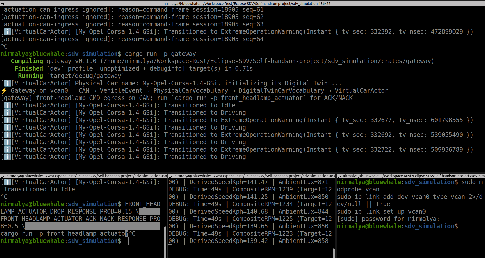
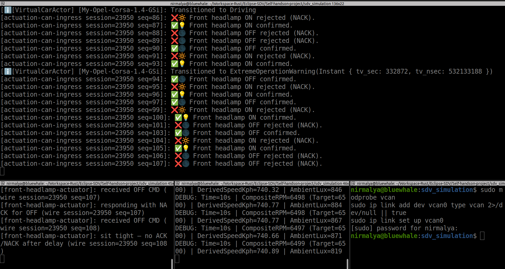
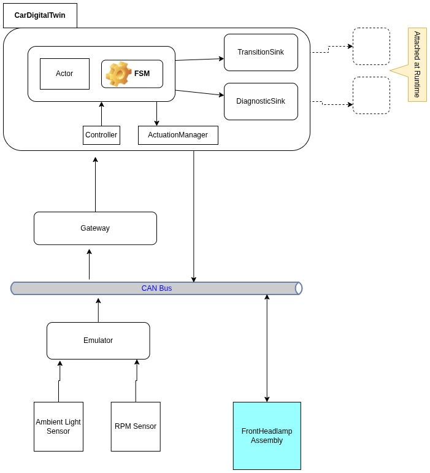

# SDV simulation (Iteration 2)— repository overview

----
↩️ Looking for the fundamentals? This project builds upon the architecture established in the 
*Iteration 1* [Repository](https://github.com/nsengupta/sdv_simulation_1).

---- 

A Rust workspace that prototypes a **software-defined vehicle control path**: telemetry and actuation on a **shared CAN bus**, a **gateway** that translates wire traffic into domain events, and a **digital twin** that maintains vehicle state, decides when to actuate, and closes the loop when the body ECU acknowledges (or fails).

This is an educational / demonstrator codebase, not a product stack.

**Companion narrative:** blog post *Prototyping a Software Defined Vehicle — Stage 2* (`Prototype-Software-Defined-Vehicle-2` in the author’s blog source) — walks from the earlier two-process model (gateway + emulator, in-process headlamp) to the bus-backed arrangement documented here.

**This README** is the repo landing page: what is implemented **now**, key decisions, limits, and how to run — for readers who already know SDV vocabulary (VSS-shaped signals, gateways, digital twins, body ECUs).

---

## What exists in this version

The prototype answers a narrow but realistic question: *can we treat the CAN bus as the single nervous system between simulated ECUs and a twin that both consumes telemetry and commands actuators with correlated feedback?*

**Three processes** share Linux **SocketCAN** (`vcan0` by default):

| Process                     | Role                                                                                                                                    |
| --------------------------- | --------------------------------------------------------------------------------------------------------------------------------------- |
| **emulator**                | Stand-in for powertrain + ambient-light sensing: publishes **engine RPM** and **ambient lux** on CAN (~10 Hz).                          |
| **gateway**                 | Owns ingress (read CAN), **projection** into twin vocabulary, the **digital twin** runtime, and egress (write headlamp **CMD** frames). |
| **front_headlamp_actuator** | Stand-in body ECU: receives CMD, replies with **ACK** or **NACK** on the same bus (~150 ms later).                                      |

Inside the gateway, the twin is **not** a loose script: it is a **`VirtualCarActor`** (mailbox, single-threaded handling) driving an **FSM** plus an orthogonal **lighting** sub-state in `VehicleContext`. Outcomes are visible on **stdout** — a deliberate stand-in for a dashboard or cloud stream (state transitions, actuation intents, alerts, headlamp correlation).

Signals are modeled in a **VSS-inspired** Rust enum (`EngineRpm`, `AmbientLux`, and a decoded-but-unused `VehicleSpeed` slot for a future observed-speed ECU). Payload layout and headlamp wire kinds live in **`vehicle_device_bus`** so the gateway stays thin and the actuator binary stays independent.

### Demo screenshots

Still frames from a live three-process run on `vcan0` (emulator, gateway, front-headlamp actuator). Both show the same gateway **stdout** surface — FSM transitions, RPM/lux telemetry, and (when lighting rules fire) headlamp actuation — under different ambient-light conditions.

**Daylight band (headlamp off)** — ambient lux stays above the OFF threshold (`LUX_OFF` 860). The twin keeps `LightingState::Off`; the gateway log has no headlamp CMD or ACK/NACK lines.



**Tunnel / dim band (headlamp on)** — lux falls through the ON threshold (`LUX_ON` 840), the twin requests ON, the gateway sends `📤🔆` CMD on CAN, and the actuator reply appears as `✅💡` (or `❌🔆` / `⏱️` on failure paths).



---

## Current Architecture

Telemetry and commands meet on one virtual CAN interface; the gateway is the only component that speaks both “wire” and “twin.”



*Architecture diagram (Stage 2 blog figure). Local copy: [`assets/SDV-Blog-Inputs-4.jpg`](assets/SDV-Blog-Inputs-4.jpg).*

**Ingress path:** CAN frame → `VssSignal` / headlamp payload → `PhysicalCarVocabulary` → `PhysicalToDigitalProjector` → `DigitalTwinCarVocabulary` → actor → `fsm::step`.

**Egress path:** `DomainAction` (e.g. request headlamp ON) → `DefaultActuationManager` → `ActuationCommand` → gateway encodes CMD → CAN → actuator → ACK/NACK → same reader thread → policy correlation → twin ACK/NACK/incomplete events.

---

## Key design decisions

**Gateway as orchestrator, not as actuator.** Earlier iterations simulated the headlamp inside the gateway over Tokio channels. Here the gateway **writes CMD and reads ACK/NACK on CAN**, matching how a real SDV stack would separate body ECUs from the service platform.

**Twin in `common`, gateway as runtime shell.** FSM rules (`transition_map`), the `step` boundary, kinematics, thresholds, and the actor live in **`common`** so tests and contracts stay deterministic without sockets. **`gateway_runtime`** only wires CAN, timers, and channels.

**Layered vocabulary.** Physical ingress uses **Confirmed/Rejected** for actuator outcomes; the FSM uses **OnAck/OffAck** and **ActuationIncomplete** (timeout vs negative ACK). That keeps wire semantics separate from twin semantics and mirrors gateway projection patterns you would keep in production.

**Speed is derived, not sensed on the bus (yet).** The emulator does not publish speed. One composite **RPM** is scaled to km/h in `vehicle_kinematics` (`rpm × 0.114`, simple tire model) on every `step`. A `VehicleSpeed` frame (`0x101`) can be decoded but is **rejected** at projection until an observed-speed path exists — kinematic expectation vs ECU measurement stay explicit.

**Operational warning uses OR + AND semantics.** Enter **`ExtremeOperationWarning`** when derived **speed > 160 km/h** *or* when **speed > 160 and RPM > 5500** (commuter “fast” vs “sustained stress”). Recovery needs a **5 s** cooldown and both conditions cleared. Buzzer and log lines reflect which threshold fired.

**Lighting is orthogonal context, not a top-level FSM state.** Lux hysteresis (`LUX_ON` 840 / `LUX_OFF` 860, demo-tuned against ~815–885 lux jitter) drives `LightingState` (Off → OnRequested → On → …) while primary states remain Off / Idle / Driving / ExtremeOperationWarning. Pending states suppress duplicate CMDs; **2 s** ACK waits surface timeout recovery on `TimerTick`.

**Device policy in `vehicle_device_bus`.** Correlation (session/sequence) and “ignore command frames on ingress” live with the codec so adding another actuated device follows the same checklist.

**Observability is human-first.** Structured logging is a TODO; demo runs rely on timestamped `println`/`eprintln` and a small emoji vocabulary in `front_headlamp_log` (📤 command, ✅ ACK, ❌ NACK, ⏱️ timeout).

**The transition log records intended actions.** Each `RawTransitionRecord` carries the domain actions the pure `step` emitted (buzzer, cloud sync, warnings, headlamp requests) as an owned, filtered snapshot for observability/replay. `EnterMode` (a runtime actor hint, not a domain intent) is excluded, and these are *intended* intents — **not** execution outcomes (ACK/timeout/failure stay separate facts). The clone is deliberate over a borrow/`Arc`: the record is published across an async channel and must own its payload, and a step emits only 0–3 actions. See `docs/design-notes-runtime-observation.md`.

---

## Digital twin: actor + FSM

The twin runtime is **`VirtualCarActor`**, a [`ractor`](https://crates.io/crates/ractor/0.15.12) **actor** — not a shared mutable object that the gateway updates directly. The gateway (via **`VehicleController`**) sends **`DigitalTwinCarVocabulary`** messages to the actor’s mailbox; each message is handled **one at a time** in `handle`, which calls the pure **`fsm::step`** boundary and then runs side effects.

**Why an actor:**

| Benefit                      | In this repo                                                                                                                                |
| ---------------------------- | ------------------------------------------------------------------------------------------------------------------------------------------- |
| **Encapsulated state**       | `DigitalTwinCar` (`FsmState` + `VehicleContext`) lives only inside the actor; ingress and timers do not race on context.                    |
| **Async, ordered handling**  | CAN-derived events, `TimerTick`, power on/off, and `GetStatus` RPCs are all **messages** — same queue, deterministic serial processing.     |
| **Separation of concerns**   | FSM code stays **pure** (`step`, `transition_map`); the actor owns **I/O** (actuation channel, logs, optional transition/diagnostic sinks). |
| **Stable platform boundary** | Gateway speaks **vocabulary + `ActorRef`**, not FSM internals — closer to how a vehicle service would target a twin API.                    |
| **Room to grow**             | Child actors, supervision, or backpressure on actuation can attach to the mailbox model without rewriting the FSM.                          |

Mailbox shape: **`Fsm(FsmEvent)`** for telemetry and control; **`GetStatus`** for snapshot queries (reply port). That keeps the FSM event set small while the runtime vocabulary can extend.

### Vehicle states in this prototype

The car’s **operational mode** is a single primary FSM (`FsmState`). What you see in logs as `Transitioned to …` and in cloud sync as `VehicleState` maps from these four values:

| State                         | Meaning                                                                                                                                                                                                    |
| ----------------------------- | ---------------------------------------------------------------------------------------------------------------------------------------------------------------------------------------------------------- |
| **`Off`**                     | Ignition off. Twin does not treat the vehicle as running; derived speed is forced to **0**; lighting context is cleared to **Off**.                                                                        |
| **`Idle`**                    | Powered on (`PowerOn` with healthy context), engine at rest — not in the “driving” band (RPM ≤ 1000 after the last update).                                                                                |
| **`Driving`**                 | Powered on and **RPM > 1000** while derived speed is non-zero. Normal motion band for the demo.                                                                                                            |
| **`ExtremeOperationWarning`** | Stress band active: derived **speed > 160 km/h** and/or **speed > 160 km/h with RPM > 5500**. Buzzer on; recovers to **Driving** or **Idle** after a **5 s** cooldown once thresholds clear (`TimerTick`). |

Typical primary flow:

```text
Off ──PowerOn──► Idle ◄──speed=0── Driving
                  ▲                    │
                  │                    │ operational_warning_active
                  └──── speed=0 ───────┤
                                       ▼
                          ExtremeOperationWarning
                                       │
                          (cooldown + thresholds clear)
                                       ▼
                                 Driving or Idle
```

**Separate from the four modes above**, front-headlamp progress is tracked in **`LightingState`** inside `VehicleContext` (not extra top-level FSM states):

| Lighting state     | Meaning                                                                      |
| ------------------ | ---------------------------------------------------------------------------- |
| **`Off`**          | Headlamp treated as off; may request ON when lux ≤ `LUX_ON_THRESHOLD` (840). |
| **`OnRequested`**  | CMD sent (or queued); waiting for ACK or timeout.                            |
| **`On`**           | ACK received; may request OFF when lux ≥ `LUX_OFF_THRESHOLD` (860).          |
| **`OffRequested`** | OFF CMD in flight; waiting for ACK or timeout.                               |

So at any instant the twin holds **one primary mode** plus **one lighting sub-state** — e.g. `Driving` + `On` while cruising with headlamps confirmed on.

### Per-message processing (inside `handle`)

1. **Apply** the event to context (RPM, lux, headlamp ACK/NACK/incomplete, power, timer).
2. **Refresh** derived speed from RPM; force speed 0 when ignition is Off.
3. **Transition** primary FSM via `transition_map` and collect `FsmAction`s via `output` (buzzer, cloud sync, warnings).
4. **Evaluate** lighting rules and emit `RequestFrontHeadlampOn/Off` when thresholds cross.
5. **Handle** lighting timeouts on `TimerTick`.
6. **Execute** domain actions (including forwarding actuation commands to the gateway’s CMD channel).

Primary drive logic (simplified): power on → Idle; RPM above idle band → Driving; zero derived speed → Idle; operational thresholds → ExtremeOperationWarning with recovery on heartbeat ticks.

---

## Intentional shortcomings

| Area              | Current choice                                          | Why it matters                                                                  |
| ----------------- | ------------------------------------------------------- | ------------------------------------------------------------------------------- |
| **VSS**           | Local `VssSignal` enum, not COVESA catalog / databroker | Fast iteration; mapping to real VSS paths is future work.                       |
| **Kinematics**    | Single RPM → speed multiplier                           | No four-wheel model, slip, gear, or observed-speed fusion.                      |
| **Lux scale**     | High values (~850), narrow hysteresis                   | Tuned so headlamp ON/OFF cycles often in a demo run, not photometric night/day. |
| **Interface**     | `vcan0` hardcoded in three binaries                     | No CLI/env yet; fine for Ubuntu + SocketCAN labs.                               |
| **Dashboard**     | stdout only                                             | No Zenoh, MQTT, or HMI; `PublishStateSync` is a log stub.                       |
| **Gateway scope** | One reader thread, one actuator device                  | No multi-bus, no security, no routing tables.                                   |
| **Speed on CAN**  | Decoded, not consumed                                   | Deliberate separation until ECU path is designed.                               |

These are documented as **non-goals for the milestone**, not oversights.

---

## Software map

| Crate                         | Responsibility                                                                                                                                                                         |
| ----------------------------- | -------------------------------------------------------------------------------------------------------------------------------------------------------------------------------------- |
| **`common`**                  | VSS encode/decode, vocabularies, projection, FSM + `step`, `VirtualCarActor`, `VehicleController`, actuation manager, `vehicle_constants`, `vehicle_kinematics`, `front_headlamp_log`. |
| **`vehicle_device_bus`**      | Front-headlamp CAN codec, wire kinds, ingress policy.                                                                                                                                  |
| **`emulator`**                | World models (RPM target tracking, lux jitter/tunnels) → telemetry frames.                                                                                                             |
| **`gateway`**                 | `main` + `gateway_runtime`: install twin, CAN loop, timer tick, CMD TX.                                                                                                                |
| **`front_headlamp_actuator`** | Blocking actuator loop on CMD with configurable drop/NACK probabilities.                                                                                                               |

Canonical FSM table: `crates/common/src/engine/op_strategy/transition_map.rs`. Lighting contract tests: `crates/common/src/test/lighting_step_contract.rs`.

---

## Wire protocol (reference)

**Telemetry** — 11-bit standard IDs, 2-byte big-endian:

| Signal        | ID      | Notes                        |
| ------------- | ------- | ---------------------------- |
| Vehicle speed | `0x101` | Decoded; **not** fed to twin |
| Engine RPM    | `0x102` | Ingress → `UpdateRpm`        |
| Ambient lux   | `0x103` | Ingress → `UpdateAmbientLux` |

**Front headlamp** — ID `0x204`, kinds in `vehicle_device_bus` (CMD / ACK / NACK for ON and OFF paths).

---

## Tests

```bash
cargo test -p common
cargo test -p gateway --lib
cargo test -p vehicle_device_bus
cargo test -p common --features proptest   # optional
```

Bus integration tests need `vcan0` up: `cargo test -p vehicle_device_bus --test front_headlamp_bus_e2e`, `cargo test -p gateway --test front_headlamp_e2e`.

---

## How to run (Linux)

**Requirements:** Linux with SocketCAN, Rust (workspace edition 2024).

```bash
sudo modprobe vcan
sudo ip link add dev vcan0 type vcan 2>/dev/null || true
sudo ip link set up vcan0
```

Three terminals:

```bash
cargo run -p emulator
cargo run -p front_headlamp_actuator
cargo run -p gateway
```

Optional gateway flags (combine as needed):

```bash
cargo run -p gateway -- --print-timer-tick          # TimerTick heartbeat on stdout
cargo run -p gateway -- --print-transitions         # FSM transition lines
cargo run -p gateway -- --trace-actuation-ingress   # ignored headlamp ingress (CMD echo, correlation); off by default
```

**Actuator with demo env** (same terminal B instead of plain `cargo run` — values must be in `0.0`..=`1.0`):

```bash
FRONT_HEADLAMP_ACTUATOR_DROP_RESPONSE_PROB=0.15 \
FRONT_HEADLAMP_ACTUATOR_ACK_NACK_RESPONSE_PROB=0.5 \
cargo run -p front_headlamp_actuator
```

| Variable                                         | Example | Effect                                                                      |
| ------------------------------------------------ | ------- | --------------------------------------------------------------------------- |
| `FRONT_HEADLAMP_ACTUATOR_DROP_RESPONSE_PROB`     | `0.15`  | ~15% of CMDs get **no** ACK/NACK on CAN (gateway may log `⏱️` timeout).     |
| `FRONT_HEADLAMP_ACTUATOR_ACK_NACK_RESPONSE_PROB` | `0.5`   | When the actuator **does** respond, P(ACK)=0.5 (default if unset: **0.7**). |

Default actuator (no env): `cargo run -p front_headlamp_actuator` — always responds after ~150 ms, ~70% ACK / ~30% NACK.

**Emulator with tunnel-frequency env** (terminal A — controls how often low-lux tunnels drive the headlamp ON; value in `0.0`..=`1.0`):

```bash
EMULATOR_TUNNEL_PROB=0.002 cargo run -p emulator
```

| Variable             | Example | Effect                                                                                          |
| -------------------- | ------- | ----------------------------------------------------------------------------------------------- |
| `EMULATOR_TUNNEL_PROB` | `0.002` | Per-100 ms-tick probability of entering a tunnel. Default (unset) `0.01` ≈ a tunnel every ~10 s (demo-frequent); `0.002` ≈ every ~50 s, `0.001` ≈ every ~100 s (infrequent). |

**Teardown:** `Ctrl+C` each process; `sudo ip link del vcan0`.

Change `DEFAULT_CAN_INTERFACE` in emulator, actuator, and `gateway_runtime` if not using `vcan0`.

**What a successful run looks like:** same as the [demo screenshots](#demo-screenshots) above — emulator debug lines with RPM/lux; gateway transitions and `📤🔆` / `📤🌑` commands; actuator `received ON/OFF CMD`; gateway `[actuation-can-ingress …]` with `✅💡` / `✅🌑` or `❌🔆` / `❌🌑`; occasional `⏱️` alerts if the actuator drops responses; buzzer lines if RPM/speed thresholds are exceeded.

---

## Dependencies (summary)

`socketcan`, `tokio` (gateway), [`ractor`](https://crates.io/crates/ractor/0.15.12) (actor), `anyhow`, `rand` (emulator models).

---

## Roadmap (ideas, not commitments)

Observed-speed ECU ingress; official VSS / databroker alignment; CLI CAN interface; richer emulator profiles; DBC-driven IDs; structured telemetry egress; additional `vehicle_device_bus` devices; Zenoh or uProtocol adapters reusing the same twin and policy core.

---

*Update this file when user-visible behaviour or repo layout changes; keep the blog as the narrative arc, this README as the current truth.*
